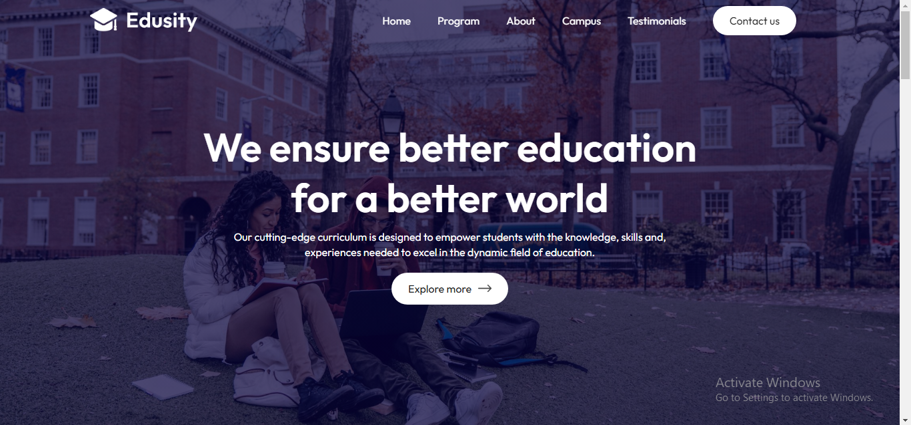
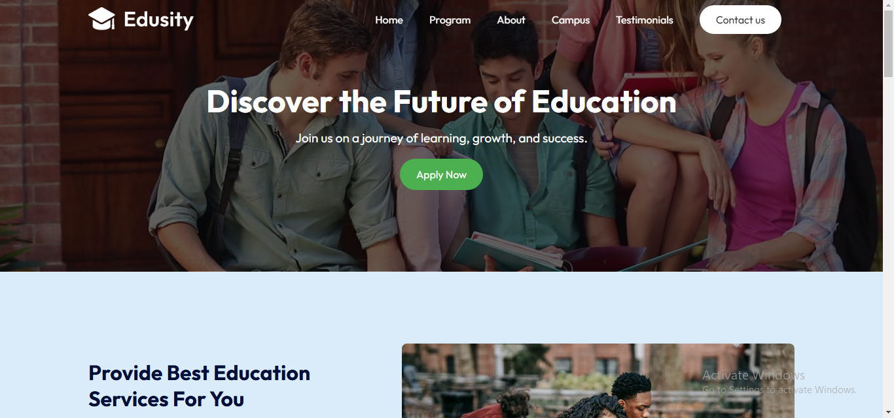
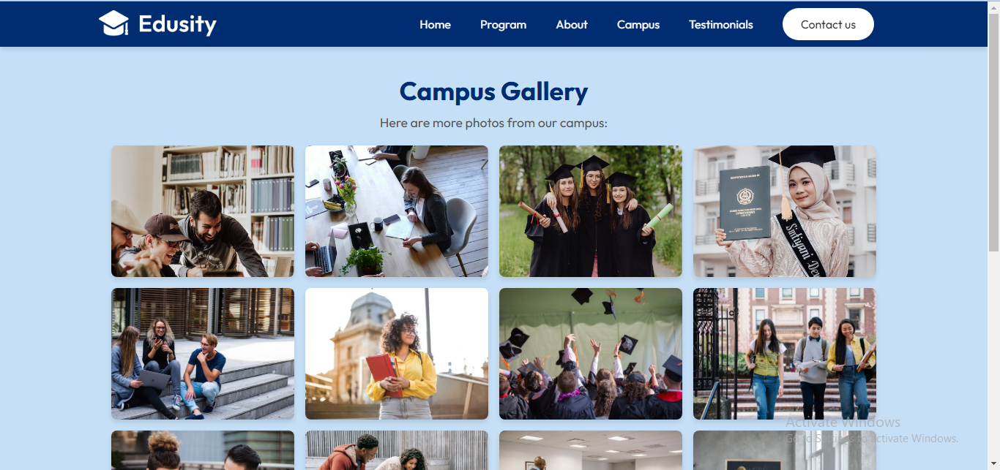

# Eduhub(Edusity): Online University Educational Platform

## Overview

This project is a fully responsive online university educational platform built using the React library (via Vite). The platform currently features three main pages:

Landing Page (Homepage): Serves as the main entry point, showcasing information about the university and its offerings.

Explore More Page: Provides additional details about programs, facilities, and other features.

Campus Gallery Page: Displays a collection of campus photos to give visitors a visual representation of the university environment.

The project is deployed on Netlify, with the build version generated using Vite’s efficient bundling process.

## Features

General Features:

1. Fully responsive design for seamless usability across devices (mobile, tablet, and desktop).
2. Interactive user interface built with React components.
3. Smooth navigation using React Router.
4. Form Validation: The contact form is integrated with Web3Forms to enable submission without a backend, ensuring user details are received securely.

## Landing Page (Homepage):

- Hero Section: Includes an engaging introduction with a call-to-action.

- About Section: Shares the university’s mission and vision.

- Video Component: Features an overlayed video player that users can interact with.

- Programs Section: Highlights the university’s offerings.

- Testimonials Section: Displays reviews from students.

- Contact Section: Encourages visitors to get in touch.

- Back-to-Top Button: Enables users to scroll back to the top effortlessly after scrolling down.

## Explore More Page:

- Detailed descriptions of programs and additional features.

## Campus Gallery Page:

- A photo gallery showcasing the university’s campus and facilities.

## Technology Stack

1. Frontend Framework: React (via Vite)

2. Deployment: Netlify

## Dependencies

The following dependencies were installed and utilized in the project:

react-router-dom: For navigation between the pages.

react-icons: For adding scalable vector icons.

react-spinners: For displaying loading spinners during page transitions.

react-countup: For creating animated number counters.

react-toastify: For displaying notifications and alerts.

### Challenges and Learnings

This project has been a significant milestone in improving my experience with the React library. Some key takeaways include:

- Understanding and implementing state management for interactive components like the video player.

- Utilizing React Router to enable smooth navigation.

- Building a responsive UI using CSS and learning to debug layout issues.

- Handling dynamic user interactions, such as the back-to-top button and video overlay controls.

- Integrating Web3Forms to validate and handle form submissions without a traditional backend.

### Next Steps

- Adding more pages to expand the platform’s functionality.

- Integrating a backend for dynamic data handling.

- Enhancing accessibility features to ensure the platform is user-friendly for all audiences.

- Implementing user authentication for a personalized experience.

### Conclusion

This project replicates a real-world online university educational platform and showcases a wide range of React capabilities. It has been an exciting journey that enhanced my technical skills and prepared me for more complex React-based applications.
